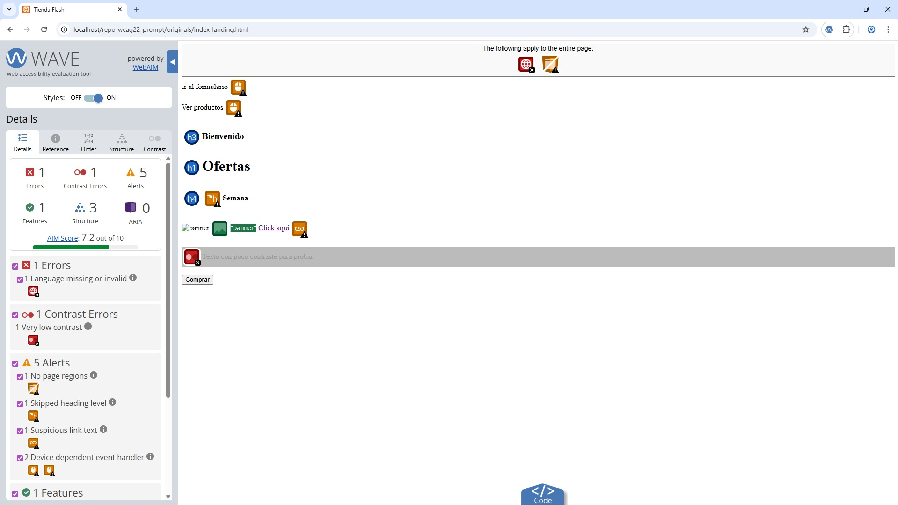
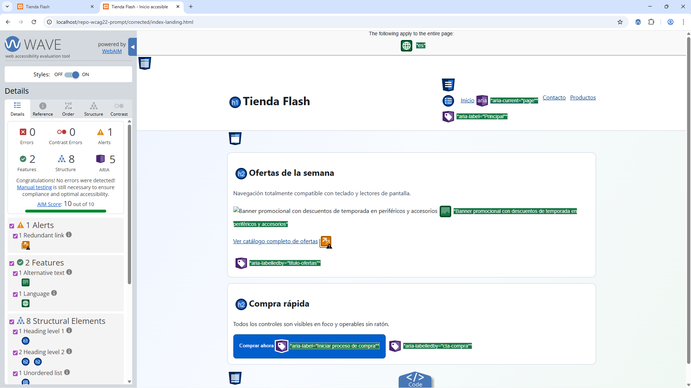
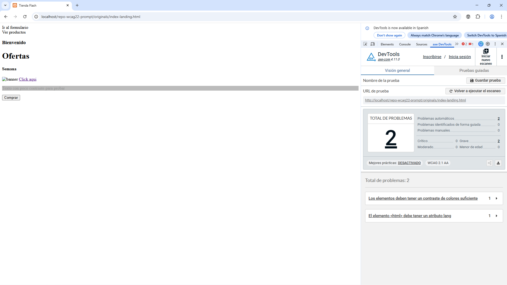
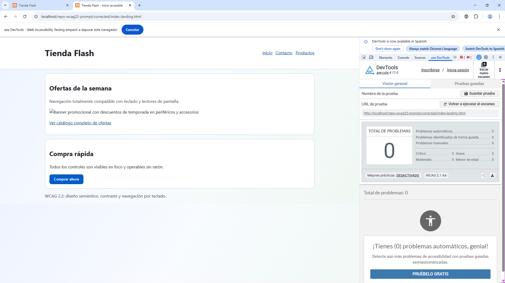
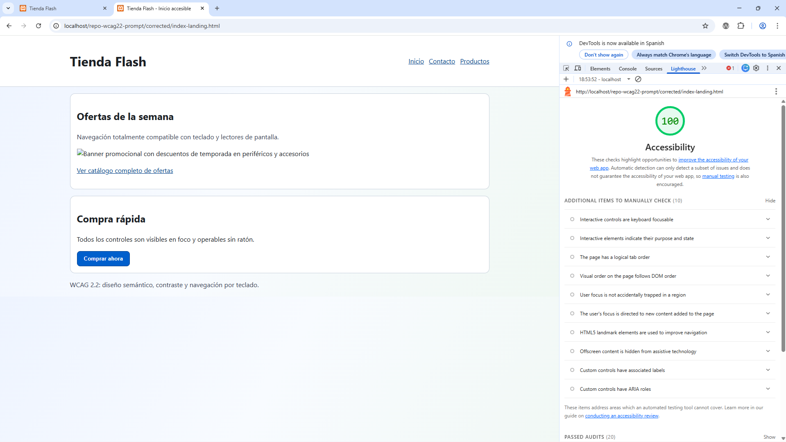

# Repositorio de Prompt de Accesibilidad WCAG 2.2

## Objetivo
Este repositorio documenta el diseño y la validación de un prompt eficaz para asistentes de programación (Copilot, Gemini y equivalentes) orientado a corregir HTML según WCAG 2.2 y buenas prácticas ARIA.

## Estructura del repositorio
- `originals/`: versiones iniciales sin foco especial en accesibilidad.
- `corrected/`: versiones corregidas aplicando semántica, ARIA y criterios A/AA (AAA opcional).
- `prompts/prompt-perfecto.md`: prompt maestro y variante estricta de reintento.
- `docs/screenshots/`: capturas de validación antes/después.
- `docs/validation/validation-log.md`: bitácora de resultados de validación.

## Proceso de desarrollo del prompt
1. Se crearon tres páginas base con problemas frecuentes de accesibilidad: `index-landing.html`, `index-form.html` e `index-table-media.html`.
2. Se redactó un prompt maestro con reglas concretas de WCAG 2.2 (semántica, estructura, contraste, teclado, formularios, tablas, imágenes y ARIA).
3. Se aplicó el prompt para generar versiones corregidas en `corrected/`.
4. Se ejecutó validación automática comparativa antes/después con WAVE, Axe DevTools y Lighthouse.
5. Se documentaron resultados y evidencias con capturas.

# 📊 Evidencias de Validación de Accesibilidad

Caso documentado: `index-landing.html`  
Comparativa antes/después tras aplicar el prompt WCAG 2.2.

---

## 🔎 WAVE

### ❌ Antes

**Problemas detectados:**
- Falta de atributo `lang` en `<html>`.
- Contraste insuficiente.
- Jerarquía incorrecta de encabezados.
- Enlaces ambiguos y falta de landmarks.

**Solución aplicada:**
- Se añadió `lang="es"`.
- Ajuste de colores para cumplir WCAG 2.2 nivel AA.
- Reorganización semántica (`h1`, `h2`, `header`, `nav`, `main`, `footer`).
- Mejora de textos de enlaces.

---

### ✅ Después

**Resultado:**
- 0 errores.
- 0 errores de contraste.
- 1 alerta menor (enlace redundante).
- AIM Score: 10/10.

---

## 🛠 Axe DevTools

### ❌ Antes

**Problemas graves detectados:**
- Elemento `<html>` sin atributo `lang`.
- Relación de contraste insuficiente entre texto y fondo.

**Solución aplicada:**
- Se añadió el atributo de idioma.
- Se ajustaron colores para cumplir WCAG 2.2 AA.

---

### ✅ Después

**Resultado:**
- 0 problemas automáticos detectados.
- Cumplimiento completo en validación automática.

---

## 🚦 Lighthouse

### ❌ Antes

**Puntuación de Accesibilidad:** 74/100  

**Problemas señalados:**
- Contraste insuficiente.
- Falta de atributo `lang`.
- Encabezados fuera de orden.
- Falta de landmark principal.

---

### ✅ Después

**Puntuación de Accesibilidad:** 100/100  

**Mejoras logradas:**
- Estructura semántica correcta.
- Navegación por teclado optimizada.
- Contraste conforme a WCAG 2.2 AA.
- Uso adecuado de landmarks HTML5.

---

## 📌 Conclusión

Tras aplicar el prompt de accesibilidad WCAG 2.2:

- ✅ Se eliminaron todos los errores críticos automáticos.
- ✅ Se mejoró la estructura semántica y ARIA.
- ✅ Se alcanzó 100/100 en Lighthouse.
- ✅ Se logró cumplimiento automático en WAVE y Axe.

El prompt demuestra ser eficaz para corregir HTML conforme a WCAG 2.2 (niveles A y AA).

